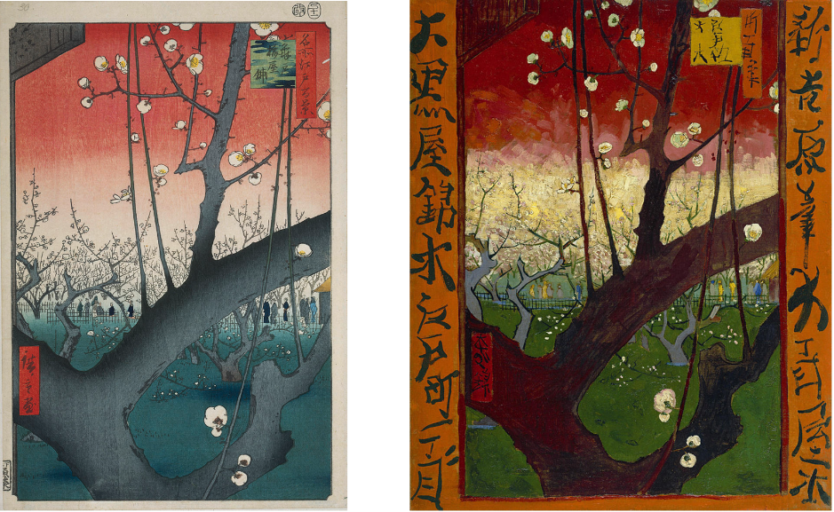

# Chapter IV.

All my life I tried to avoid copying as much as possible. From my experience copying was viewed as something negative: "Do you copy? You're a stealer!"  When I was little, copying was called *monkeying* in our Czech elementary school, that meant if you were copying something from somebody else, you were a *copymonkey*, so like a copycat in English, but with monkeys instead! Your schoolmates would publicly shame you for copying. In our class copying was simply a *taboo*.

But what if you liked the stuff you saw your classmate do? I would get jealous easily and try to implement something that I liked from his work into mine to make my work look better. Basically, I tried to copy other peoples ideas in a very subtle way so nobody would notice. I would just tweak something in my work to make it look a little better. But was it really copying? What is the boundary between copying and inspiration?

To many, it's a matter of personal opinion, but when somebody is really proud of their work, they get angry if someone copies even just a tiny thing from their work. But maybe we shouldn't see copying in a negative light. After all, seeing somebody being inspired by your work, can mean that they really like your work. When you get older, you learn to acknowledge the masters people before you, for example the old masters in art. Many artists were inspired by their previous peers like Vincent van Gogh who liked Baroque Dutch masters and Japanese paintings. Japanese art was seen as something new and hip in 19th century Europe and inspired Van Gogh in many ways. He liked to copy works from the Japanese master Hiroshige to further his style.

***from left to right: Hiroshige, Plum Garden at Kameido, 1857 / Vincent Van Gogh, Flowering Plum Tree (after Hiroshige), 1887***

So we could go as far and say that without copying, Van Gogh wouldn't be able to expand his style of painting. Many other artists such as the Impressionists did the same thing as well! You could say, the pereception of how we view copying today started to gradually shift when we entered the 20th century with the Industrial Revolution on the way and the expansion of a more market economy and the rise of a new social class, where everybody could gain something my claiming their property or work. Copying started to be seen as something negative as if somebody is trying to steel my patented invention.

But copying was always part of our culture and eventually, there will be a moment when we will have to copy somebody else to expand our skills and knowledge. For example, when I was in High School, I would try to learn to do my own original stuff in graphic design, but in some occasions it gets hard and there is no other way, than to get inspired by previous peers.

So yes, copying was always part of our history and it's not something that will go away. Copying enriches our knowledge and helps us evolve and once we copy enough we can get to our own unique style. It can also depends on our intentions. Copying can be done in a harmful way, when other people are exploiting other peoples ideas for their own projects or their own personal gain, but just like inviting someone to our own personal property, that was owned by somebody before us and the person before them, we can change our perception on copying as not seeing it as copying in a bad way, but working with previous sources instead.
